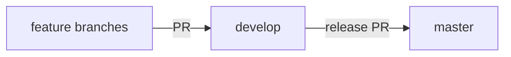

# Spendbrains — Branching & releases

> Hub → [README.md](./README.md) · Deployment → [deployment.md](./deployment.md)

## Branch model

| Branch | Role | Who merges here |
|--------|------|-----------------|
| `develop` | Integration / staging | Every feature PR |
| `master` | Production | Release PRs from `develop` only |



## Day-to-day workflow

1. Branch from `develop`:
   ```bash
   git checkout develop
   git pull origin develop
   git checkout -b feature/my-change
   ```
2. Open a PR into **`develop`**.
3. After merge, staging deploys from `develop`.

## Release workflow (develop → master)

1. Ensure `develop` is green and ready for production.
2. Open a PR **`develop` → `master`**.
3. Review, merge, and tag if needed.
4. Production deploys from `master`.

Direct pushes to `master` are not allowed. Only the release PR path is permitted.

## GitHub enforcement

Repository automation enforces this flow:

| Check | What it does |
|-------|----------------|
| **Branch policy** | Rejects PRs that do not target `develop` (features) or `master` (releases from `develop` only) |
| **CI** | Lint, test, and build on PRs to `develop` and `master` |

## One-time admin setup

After `develop` and `master` exist on GitHub, a repo admin runs:

```bash
chmod +x .github/scripts/setup-branch-protection.sh
./.github/scripts/setup-branch-protection.sh
```

That script:

- Sets **`develop`** as the default branch
- Protects **`master`** (required reviews, required checks, no force-push)
- Protects **`develop`** (required checks)

The Cursor agent token cannot apply branch protection rules; an admin must run the script (or mirror the same settings in GitHub → Settings → Branches).

## Legacy `main`

The repository previously used `main` for production. New work should use **`master`** (production) and **`develop`** (integration). Remove `main` after:

1. Default branch is `develop`
2. `master` exists and is protected
3. Deploy targets (`Cloudflare Pages`, etc.) point at `master`
